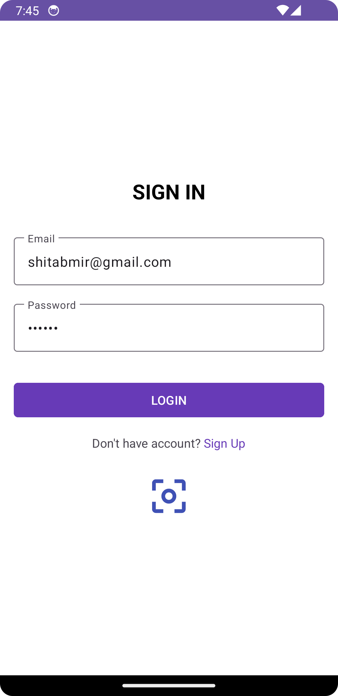

# RentBuySellRepeat

**The following commented points indicated where to add new elements**
// TODO: ADD HERE -> 

**The following commented points indicated [WIP] or incomplete work**
// TODO: SHITAB will ...

** Layers of the Project **
- data
  - database, 
  - dao, 
  - entity, 
  - response & request models, 
  - repository, 
  - local and remote source
- di
  - AppModule (Here to Add anything that needs to be injected to the project)
  - Retrofit Network injected
- domain
  - repository interfaces,
  - use cases (Single responsibility for each use case)
- network
  - api endpoints, 
  - interceptors
- presentation
  - base activity and fragment added for commonly used logic
  - features: Activities, fragments, view models, adapters
- util
  - extension class for commonly used functions
  - helper classes for validation, 
- MyApplication class

**Used Technologies**
- Java Version 17
- Kotlin Version 2.0.21
- Gradle 8.11.1
- Android Studio Version: Android Studio Meerkat | 2024.3.1 Patch 2

- Dependency Injection: Kotlin Koin
- Architecture: MVVM, Clean Architecture, Repository
- Database: Room 
- Network: Retrofit
- Image Loading: Glide
- Preference Data: DataStore (for storing login data)

# Setup Description

** Environment & Flavors **
- devDebug, devRelease (with BaseUrl: https://shitab14.github.io/jsons/teebay/) (Hosted in Github pages)
- qaDebug, qaRelease (with BaseUrl: http://127.0.0.1:8000/) (DOESN'T WORK YET)
- prodDebug, prodRelease (with BaseUrl: http://127.0.0.1:8000/) (DOESN'T WORK YET)

** Application Class **
- Koin Modules are setup in the MyApplication.kt
- Module class is in **AppModule.kt** where many types of Modules are setup

** Splash Screen Logic **
- Check Authentication (If the user logged in or not)

** Login Screen Logic **
- Email & Password Input Validation
- Login API Call 
- Biometric implementation (Unable to check)
- Page Navigation to Registration Page
- Save Login Data to DataStore
  

 
** Register Screen Logic **
- All Field Input Validation
- Register API Call
- Page Navigation to Login Page
- Save Login Data to DataStore

** MyProductList Page **
- My Products API Call
- RecyclerView Implementation
- Page Navigation to Add Product Page, Product Details Page, Edit Product Page, Delete Page
- Swipe to Refresh
- Action Drawer Implementation
- Log out Logic Implementation

** Add Product Page ****
- LoaderBar Implementation
- All Field Input Validation
- Navigation and Fragments Viewpager Steps handled
- Temporary Caching Data (Didn't do storage caching)
- Category API Call
- Image Picker Implementation
- Camera Implementation
- Permission Handling
- Multipart API Call (Setup done, unable to check)

# App Recording
[AppJourney.webm](https://drive.google.com/file/d/1pRF2SOXhUJGuTf_UqN9pL6fzEdQ0YDYA/view?usp=sharing)

** Used Devices **
- Macbook Pro M1 (2020)
- Android Studio Emulator: Pixel 3A API 34

** API Mocking **
- Was unable to run Django Project
- Hosted APIs in Github Pages (https://shitab14.github.io/jsons/teebay/)
- POST and MutliPartBody POST, and DELETE Calls were mocked as GET Calls (unable to perform POST and DELETE Calls from Github Pages)

** Generative AI Usage: **
Auto Code completion was used using Android Studios integrated Gemini
For many Utility Classes used Google Gemini 
For Architectural Components used Deepseek AI
Used all of the free tools

Initial Prompt in Deepseek AI: 

"Create an Android App skeleton for me. It will use Kotlin and xml (not Java), kts for gradle, koin (not Dagger-hilt) for Dependency Injection, Room for Database, RESTFUL (Retrofit) for API Calls, use Clean Architecture with MVVM, will follow SOLID Principals and will follow TDD.

Project will have an Application class named MyApplication.kt
Will have BaseActivity and BaseFragment Class which other Activity and fragments will extend to.
folders should be divided into data(database and data layer), domain(use cases), presentation(view models and views), util (utils such as snacker, dialogs, Camera Util, Image Picker(single/multiple),  commonly used operations etc), network (for API Calls, loggers, Exception Handlers etc).

Enable BuildConfig and view and data binding in gradle, use JavaVersion.VERSION_17, keep base_url and API keys in gradle (for now)"

Through out many prompts were used to get the desired results into Deepseek and Gemini depending on needs. 

